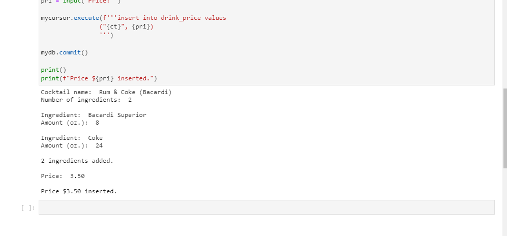

# Inventory Management: Using SQL and Jupyter Notebooks to Better Organize Liquor Inventory

A friend of mine runs a bar and has consistently struggled to manage his inventory and financial records. He asked me to help him better organize his inventory, which I have chosen to do using MySQL connector library in Jupyter notebooks. These programs are set up so my friend, whom is quite computer illiterate, can simply open the corresponding program for whichever task he would like to do (viewing inventory records, update menu items, calculate cost ratios, etc.), simply hit "Run progam" at the top, and can insert his records as see fit.

Programs are separated into two categories for easier use: ***'Search'*** files,  and ***'Update'*** files.

This repository does not contain all programs written for the bar, just a few to simply demonstrate the mechanics of the tools used.

All programs were written between July - September of 2020.

**NOTE:** All programs are written to use data and passwords stored on the bar's personal server. For this reason, these codes will not run on an external system.

## "Search" Records

The **'Search'*** folder contains programs which primarily focus on searching through available records by calling specific data from the **bar-invetory** database.

### Search Inventory Records

To search the bar's inventory of available liquors, provided are two programs, ****search_inventory.ipynb**** and ****search_inventory_num.ipynb***, both of which call data from the **inventory** table. To search for a dimension (string) field with a text specifyer (eg. liquor, brand, etc.), open the ****search_inventory.ipynb**** program, then first specify with "Select" what field to search, then the search term, "As". What returns is a pandas Dataframe of all information regarding that search used (this data will be discussed further under "Insert into Inventory"). 

In the example below, the user wishes to search the subliquor "Bordeaux" within the liquor category "Red Wine". To do this, he first specifies to select from the "subliquor" column, then specifies the search term, "Bordeaux". What returns is the only Bordeaux in the inventory, "Chateau Bellevue Bordeaux", with all associating data.

To search a numeric (interger or float) variable, open the ****search_inventory_num.ipynb**** program, then first specify with "Select" what field to search, then place the comparative qualifyer the search term, "To". In the following example, the user wishes to find what liquors have a price greater than $10. To do this, he specifies to search "Price", then states he wants ">" (greater than), and finally specifies "10". What returns is data from 75 products, all of which have a price greater than $10.

### Search Cocktail List

In order to search data regarding mixed drinks served and sold at the bar, the user will use the ****search_cocktail.ipynb**** program, which calls data from two sources, the **drinklist** table, which contains data regarding ingredients and amounts for specific drinks (this will be discussed further under "Insert into Cocktail List"), and the **drink_profit** view, which itself calls and runs calculations on data from the **Inventory**, **drinklist**, and **drink_price**. The only specifier requested from the user is the name of the drink, and returned is the list of ingredients with amounts, the price, the cost to make, and the profit produced for one drink.

The **drink_profit** first pulls the cocktail name and price from the **drink_price** table. It then calculates the cost of to produce one drink by calling the ingredients and amounts from **drinklist** and joins price and volume from **inventory** to calculte exact cost to produce one drink. It then joins to subtract Cost from Price to produce Profit. 

In the example below, the user searches for a simple cocktail, a Rum and Coke, with Bacardi Rum. Returned are the two ingredients, the menu price, cost, and profits produced on one order.

## "Update" Records

The **'Update'*** folder contains programs which primarily focus on adding, changing, or otherwise updating the data stored in the **bar-invetory** database.

### Insert into Inventory

To insert new records into the **Inventory** table, we will use the ****insert_into_inventory.ipynb**** program. Eight details will be requested from the user:

- ***SKU*** - Stock-Keeping Unit; a unique title for a product. 
- ***Brand*** - Brand of the product.
- ***Liquor*** - Particular type of alcohol which the product is categorized.
- ***Subliquor*** - Subcategory of the ***liquor*** field.
- ***Volume*** - The volume in *****milliliters***** of one unit ordered.
- ***Price*** - Wholesale price of one unit ordered.
- ***Rating*** - If available, professional rating of higher quality liquors. (Insert "null" if unavailable)
- ***OrderDate*** - Date the product was last ordered. 

In the example below, the red bordeaux with SKU "Chateau Bellevue Bordeax" is added it **Inventory**:

### Insert into Cocktail Recipe List

The ****insert_into_drinklist.ipynb**** affects two tables, **drinklist** and **drink_price**.

The **drinklist** table stores unique recipes for each cocktail served. Because recipes vary widely, a new record is recorded for each individual ingredient. Three columns are stored:

- ***Cocktail*** - The name of the cocktail.
- ***Ingredient*** - The specific SKU of the ingredient used.
- ***Amount*** - The volume amount in *****ounces***** of the ingredient needed.

The **drink_price** table only stores two details:

- ***Cocktail*** - The name of the cocktail.
- ***Price*** - The menu price of the cocktail.

The program first requests the cocktail name and the number of ingredients. For each ingredient, the ingredint name and amount are then requested, and the number of records added is comfirmed. The price of the cocktail is then request, and comfirmation is displayed if accepted.

In the example below, the user inserts detail for a simple two ingredient cocktail, a Rum and Coke, made with Bacardi rum:

### Update Inventory Records

Changes are often needed to be made to the items stored in the Inventory, and to do this we use the ****update_inventory.ipynb**** program. When run, the first criteria request is which field needs to be changed, followed by which product the changes will be applied to, specifying ****SKU**** of the product, and finally the value to which will be updated. After this, a call is made to inventory for the product to see changed made.

In the example below, the user needs to change the price of "Chateau Bellevue Bordeaux" to $11.69. The user first specifies the "price" column, then "Chateau Bellevue Bordeaux", and finally updated price "11.69". The updated inventory record is then displayed underneath. 

